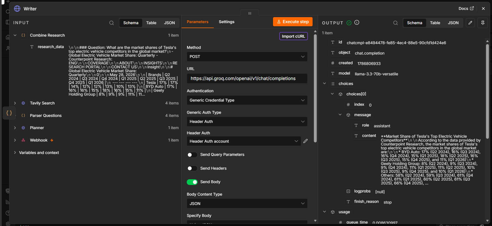

# AI Research Assistant (n8n Multi-Agent Workflow)

I got tired of doing manual competitor research every time I needed a quick market overview, so I built this as an experiment in multi-agent automation using n8n.

You give it a topic and it does the rest — breaks it down into research questions, searches the web for each one and writes up a proper report. No manual digging required.

## What it actually does

Give it something like "Analyze top competitors of Tesla" and here's what happens behind the scenes:

1. An AI planner (Llama 3.3 via Groq) reads the topic and comes up with 3-4 specific questions worth researching
2. Each question gets searched independently on the web using Tavily
3. All the raw research gets pulled together into one dataset
4. A second AI pass (the "writer") takes all that data and turns it into an actual readable report — not just a dump of search results

It's basically a mini research team running as a workflow.

## Why I built it this way

Most automation projects I see are single-step — trigger goes in, one API call happens, output comes out. I wanted to build something that shows actual orchestration: an agent that plans, delegates, gathers and synthesizes. That felt like a better representation of where AI automation is actually heading.

## Stack

- n8n for the orchestration
- Groq (Llama 3.3 70B) for planning + writing — fast and free tier is generous
- Tavily for the web search piece

## Running it yourself

1. Import the workflow JSON into n8n
2. Drop in your own Groq and Tavily API keys (both have free tiers, no card needed)
3. Activate it, hit the webhook with a topic:
   { "topic": "your topic here" }
   
5. Wait a few seconds, get your report back

## Known limitations / things I'd improve next

- Right now it always generates exactly 3-4 sub-questions — could make this dynamic based on topic complexity
- No source deduplication yet if multiple questions surface the same article
- Would like to add a step that formats the final output as an actual PDF instead of raw text

This was mainly a learning project to get comfortable with multi-step agent workflows, but it's genuinely useful for quick research now.
